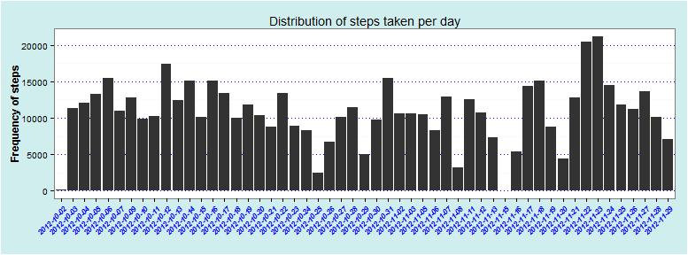
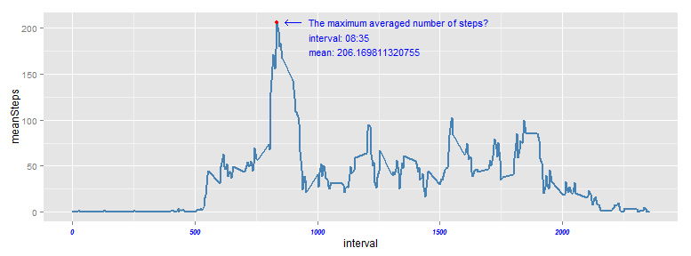
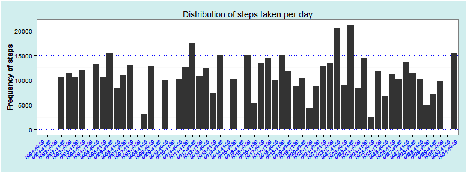
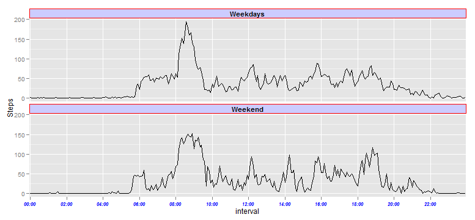
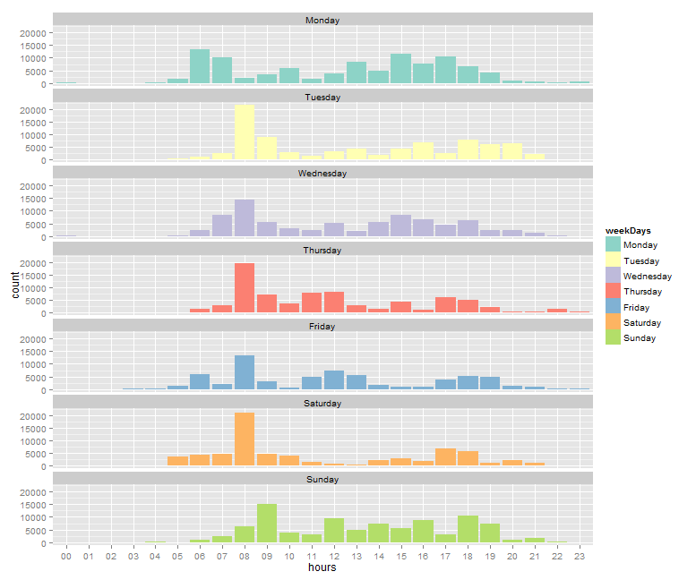

# Reproducible Research: Peer Assessment 1

## Synopsis

It is now possible to collect a large amount of data about personal
movement using activity monitoring devices such as a
[Fitbit](http://www.fitbit.com), [Nike
Fuelband](http://www.nike.com/us/en_us/c/nikeplus-fuelband), or
[Jawbone Up](https://jawbone.com/up). These type of devices are part of
the "quantified self" movement -- a group of enthusiasts who take
measurements about themselves regularly to improve their health, to
find patterns in their behavior, or because they are tech geeks. But
these data remain under-utilized both because the raw data are hard to
obtain and there is a lack of statistical methods and software for
processing and interpreting the data.

This assignment makes use of data from a personal activity monitoring
device. This device collects data at 5 minute intervals through out the
day. The data consists of two months of data from an anonymous
individual collected during the months of October and November, 2012
and include the number of steps taken in 5 minute intervals each day.

## Data

The data for this assignment can be downloaded from the course web
site:

* Dataset: [Activity monitoring data](https://d396qusza40orc.cloudfront.net/repdata%2Fdata%2Factivity.zip) [52K]

The variables included in this dataset are:

* **steps**: Number of steps taking in a 5-minute interval (missing
    values are coded as `NA`)

* **date**: The date on which the measurement was taken in YYYY-MM-DD
    format

* **interval**: Identifier for the 5-minute interval in which
    measurement was taken


The dataset is stored in a comma-separated-value (CSV) file and there
are a total of 17,568 observations in this
dataset.


## Loading and processing the data


```r
# initialisation
file_dir <- "ActivityMonitoring(quantified self)"
file_name <- "activity.csv"
# file_path <- file.path('./data/CourSera', file_dir, file_name)
file_path <- file.path(getwd(), file_name)
```


```r
# Built a data frame with tha data source
classes <- c(steps = "character", date = "factor", interval = "integer")
DFtoto <- read.csv(file = file_path, header = TRUE, colClasses = classes, sep = ",", 
    na.strings = "NA", comment.char = "", nrows = 17568)
```


```r
# step1: foramtting varaiable 'date' to DATA format
DFtoto$date <- as.Date(as.character(DFtoto$date, format = "%d/%m/%Y"))
# step2: Converting the type of the variable 'steps' to numeric
DFtoto$steps <- as.numeric(DFtoto$steps)
```


## What is mean total number of steps taken per day?

The missing values in the dataset are ignored.


```r
# Built an aggregated data frame
DFaggDay <- setNames(aggregate(steps ~ date, DFtoto, FUN = "sum", na.rm = TRUE), 
    c("date", "sumSteps"))
```


```r
library(ggplot2)
# When the data contains y values in a column, use stat='identity'
p <- ggplot(DFaggDay, aes(x = factor(date), y = sumSteps)) + geom_bar(stat = "identity")
p <- p + labs(title = "Distribution of steps taken per day", x = "", y = "Frequency of steps")
p <- p + theme(plot.title = element_text(size = 14, face = "bold", colour = "red"))
p <- p + theme_bw()
p <- p + theme(axis.text.x = element_text(colour = "blue", face = "bold.italic", 
    angle = 45, size = 8, hjust = 1, vjust = 1))
p <- p + theme(axis.title.y = element_text(face = "bold"))
p <- p + theme(panel.grid.major.x = element_blank(), panel.grid.major.y = element_line(colour = "blue", 
    linetype = "dotted", size = 0.1))
p <- p + theme(plot.background = element_rect(fill = "lightcyan2"))
p
```

 


```r
# calculate the mean and median total number of steps taken per day
meanSteps = round(mean(DFaggDay$sumSteps), 2)
medianSteps = round(median(DFaggDay$sumSteps), 2)
```


**For the total number of steps taken per day:**
- **Mean: 10766.19**
- **Median: 10765**


## What is the average daily activity pattern?


```r
# generate a data frame to work with this new issue
library(data.table)
DTtoto <- data.table(DFtoto, key = "interval")
DFaggIntv <- as.data.frame(DTtoto[, list(sumSteps = sum(steps, na.rm = TRUE), 
    meanSteps = mean(steps, na.rm = TRUE), maxSteps = max(steps, na.rm = TRUE)), 
    by = interval])
```


```r
# create the label to contain the information about the peak data
library(proto)
library(gsubfn)
library(DBI)
library(RSQLite)
library(RSQLite.extfuns)
library(sqldf)
library(grid)
library(tcltk)

DFpeak <- sqldf("select interval, meanSteps from DFaggIntv\n                where meanSteps = (select max(meanSteps) from DFaggIntv)")

mylabel <- sprintf("The maximum averaged number of steps? \ninterval: %s \nmean: %s", 
    sprintf("%02d:%02d", DFpeak$interval%/%100, DFpeak$interval%%100), DFpeak$meanSteps)
```


```r
library(ggplot2)
# generate the plot
p <- ggplot(data = DFaggIntv, aes(x = interval, y = meanSteps))
p <- p + geom_line(color = "steelblue", size = 1)
p <- p + theme(axis.text.x = element_text(colour = "blue", face = "bold.italic", 
    size = 8))

# Add anotation contains the maximum number averaged of steps
p <- p + geom_point(data = DFpeak, aes(x = interval, y = meanSteps), colour = "red", 
    size = 2)
p <- p + annotate("segment", x = (DFpeak$interval + 30), y = DFpeak$meanSteps, 
    xend = (DFpeak$interval + 100), yend = DFpeak$meanSteps, size = 0.2, colour = "blue", 
    arrow = arrow(ends = "first", angle = 45, length = unit(0.2, "cm")))
p <- p + annotate("text", label = mylabel, x = (DFpeak$interval + 130), y = DFpeak$meanSteps, 
    size = 4, colour = "blue", hjust = 0, vjust = 0.9)
p
```

 


## Imputing missing values

### Identify the missing values


```r
# take data in wide format and stack a set of columns into a single column
library(reshape2)
dim_vars = colnames(DFtoto)
DFdistNA <- melt(is.na(DFtoto), id.vars = dim_vars, variable.name = c("idrow", 
    "DFvariable"), value.name = "NAvalue")
colnames(DFdistNA) <- c("IDrow", "DFvariable", "NAvalue")

# cross tab
table(DFdistNA$DFvariable, DFdistNA$NAvalue)
```

```
##           
##            FALSE  TRUE
##   steps    15264  2304
##   date     17568     0
##   interval 17568     0
```


### Missing values strategy

The missing values are all contained in the variable 'steps'.
So presuming that during a specific period there is no steps recorded by a device.
This phenomenon is traducted with NA's. So the NA's values will be replaced by the value 0.

### Generate new dataset replacing the NA's


```r
# copy of the original data set
DFtotoAll <- DFtoto
# replacing NA's with 0
DFtotoAll[is.na(DFtoto), 1] <- 0

# step1: foramtting varaiable 'date'
DFtotoAll$date <- as.Date(as.character(DFtotoAll$date, format = "%d/%m/%Y"))
# step2: Converting the type of the variable 'steps'
DFtotoAll$steps <- as.numeric(DFtotoAll$steps)
```


### Generate Make a histogram of the total number of steps taken each day


```r
# Built an aggregated data frame
DFaggDay <- setNames(aggregate(steps ~ date, DFtotoAll, FUN = "sum"), c("date", 
    "sumSteps"))
```


```r
library(ggplot2)
# When the data contains y values in a column, use stat='identity'
p <- ggplot(DFaggDay, aes(x = factor(date), y = sumSteps)) + geom_bar(stat = "identity")
p <- p + labs(title = "Distribution of steps taken per day", x = "", y = "Frequency of steps")
p <- p + theme(plot.title = element_text(size = 14, face = "bold", colour = "red"))
p <- p + theme_bw()
p <- p + theme(axis.text.x = element_text(colour = "blue", face = "bold.italic", 
    angle = 45, size = 8, hjust = 1, vjust = 1))
p <- p + theme(axis.title.y = element_text(face = "bold"))
p <- p + theme(panel.grid.major.x = element_blank(), panel.grid.major.y = element_line(colour = "blue", 
    linetype = "dotted", size = 0.1))
p <- p + theme(plot.background = element_rect(fill = "lightcyan2"))
p
```

 


### Calculate and report the mean and median total number of steps taken per day


```r
# calculate the mean and median total number of steps taken per day
meanSteps = round(mean(DFaggDay$sumSteps), 2)
medianSteps = round(median(DFaggDay$sumSteps), 2)
```


**For the total number of steps taken per day:**
- **Mean: 9354.23**
- **Median: 10395**

Comparing with the calculations done in the first section of this document, 
the impact of the missing data seems rather low.

## Are there differences in activity patterns between weekdays and weekends?

Use of the dataset "DFtotoAll" with the filled-in missing values.


```r
# Create a new factor variable with two levels - 'weekday' and 'weekend'
DFtotoAll$weekType <- ifelse(weekdays(DFtotoAll$date) %in% c("Saturday", "Sunday"), 
    "Weekend", "Weekdays")

# generate a new aggregate data frame
DFaggWtype <- setNames(aggregate(steps ~ weekType + sprintf("%02d:%02d", interval%/%100, 
    interval%%100), DFtotoAll, FUN = "mean"), c("weekType", "interval", "Steps"))
```


###  Time series plot of the average number of steps taken by the week type.


```r
# make a serie for shaping the axis x
x_breaks <- format(seq(from = as.POSIXct("00:00", "%H:%M", tz = "UTC"), to = as.POSIXct("23:00", 
    "%H:%M", tz = "UTC"), by = "2 hour"), "%H:%M")

library(ggplot2)
p <- ggplot(data = DFaggWtype, aes(x = interval, y = Steps, group = weekType))
p <- p + geom_line()
p <- p + scale_x_discrete(breaks = x_breaks)  # Set tick every 2 hours
p <- p + facet_wrap(~weekType, ncol = 1)
p <- p + theme(strip.text.x = element_text(size = 11, angle = 0, face = "bold"))
p <- p + theme(strip.background = element_rect(colour = "red", fill = "#CCCCFF"))
p <- p + theme(axis.text.x = element_text(colour = "blue", face = "bold.italic", 
    size = 8))
p
```

 


###  Histograms over factor variables "DAYS".

Use of the dataset "DFtotoAll" with the filled-in missing values.


```r
# generate a data frame aggregate by weekday and interval
DFaggWday <- setNames(aggregate(steps ~ weekdays(DFtotoAll$date) + substr(sprintf("%04d", 
    DFtotoAll$interval), 1, 2), DFtotoAll, FUN = "sum"), c("weekDays", "hours", 
    "steps"))
# order and convert the variable 'weekdays'
DFaggWday$weekDays <- factor(DFaggWday$weekDays, levels = c("Monday", "Tuesday", 
    "Wednesday", "Thursday", "Friday", "Saturday", "Sunday"), ordered = T)
# convert the variable 'hours' to factor
DFaggWday$hours <- factor(DFaggWday$hours)
```


```r
# create the chart
library(ggplot2)
p <- ggplot(data = DFaggWday, aes(x = hours))
p <- p + geom_histogram(aes(weights = steps, fill = weekDays))
p <- p + scale_fill_brewer(palette = "Set3")
p <- p + facet_wrap(~weekDays, ncol = 1)
p
```

 

